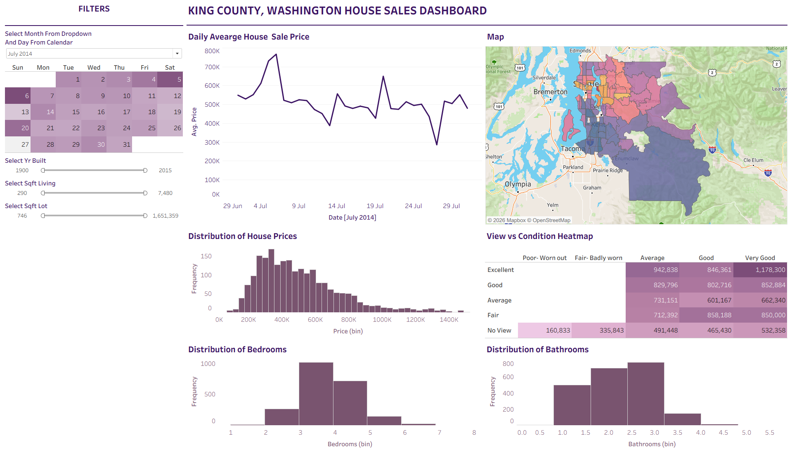
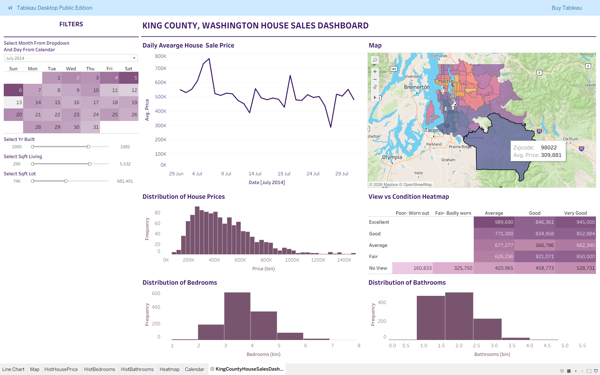
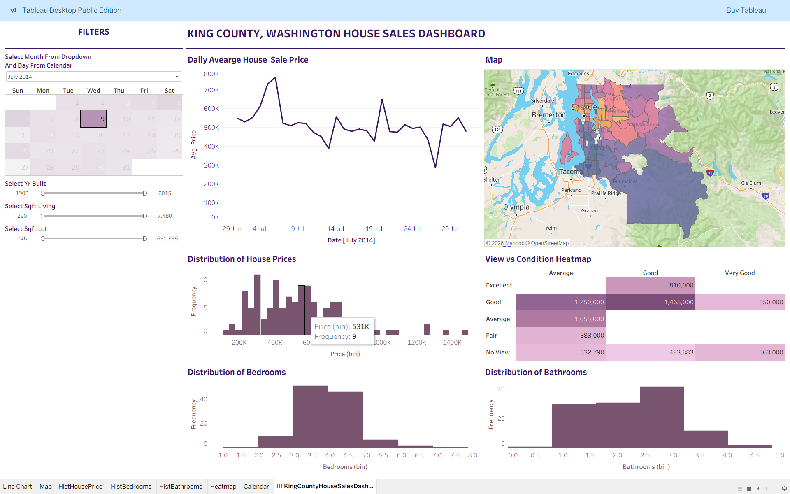

# King County House Sales – Tableau Dashboard

An interactive Tableau dashboard built to perform exploratory data analysis (EDA) on real-world house sales data from King County, Washington (Seattle area). The dashboard allows users to explore housing price trends across time, geography, and property features through interactive visualizations and filters.

🔗 **Live Dashboard (Tableau Public):**  
https://public.tableau.com/app/profile/prakruti.parmar4439/viz/KingCountyHouseSalesDashboard_17703137724920/KingCountyHouseSalesDashboard  

📂 Dataset Source:

---

## 📂 Project Structure
```
King-County-House-Sales-Tableau/
│
├── data/ # Dataset used for analysis
├── images/ # Dashboard screenshots
│ ├── snapshot1.png
│ ├── snapshot2.png
│ └── snapshot3.png
└── tableau-dashboard/ # Tableau workbook / files
```
---

## 📊 Dashboard Features

- 📅 **Daily Average Sale Price Trend**  
  Analyze how average house prices change over time.

- 🗺️ **Geographic Price Distribution (Map)**  
  Visualize average sale prices across zip codes in King County.

- 🏠 **Price & Feature Distributions**  
  Histograms for house prices, bedrooms, and bathrooms.

- 🔥 **View vs Condition Heatmap**  
  Explore how house prices vary based on property condition and view quality.

- 🎛️ **Interactive Filters**  
  Filter by:
  - Date (calendar selection)  
  - Year built  
  - Living area (sqft)  
  - Lot size (sqft)  

---

## 🔍 Exploratory Data Analysis (EDA)

This project focuses on visual exploratory analysis to uncover patterns and insights, including:

- Trends in house prices over time  
- Regional price variations across King County  
- Distribution of housing prices and key features  
- Impact of property condition and view quality on sale price  
- Price differences across filtered property segments  

The dashboard is designed to support intuitive, interactive data exploration without requiring coding.

---

## 🛠 Tools & Technologies

- **Tableau Public** – Interactive dashboard & data visualization  
- **Exploratory Data Analysis (EDA)** – Trend, geographic, and feature analysis  

---

## 📸 Dashboard Snapshots

Here are a few views from the dashboard:





---

## 📬 Contact

If you have any feedback or suggestions, feel free to connect with me on LinkedIn or open an issue in this repository.
